# Konnektivitätsdemo

Die Axon Ivy Connectivity (REST/SOAP) Demo ist eine umfassende Sammlung von
Beispielen, die die Verwendung von Standardarchitekturprinzipien zur Erstellung
interaktiver Webdienste veranschaulichen.

Diese Demo-Beispiele veranschaulichen

- Wie Sie auf Ihren eigenen REST-Dienst zugreifen können
- Ein Geschäftsprozess, der über einen REST-Dienst aufgerufen wird.
- Asynchrone Dienste über REST (benutzerdefinierte Chat-Implementierung)
- So funktioniert das Daten-Mapping über REST
- Dateien über REST hochladen
- REST in Kombination mit OpenAPI und OData
- Viele Beispiele für die Verwendung von SOAP-Diensten in der Plattform

Weitere Informationen zu [Integrationen von
Drittanbietern](https://developer.axonivy.com/doc/9/concepts/3rd-party-integration/index.html)
finden Sie in unserer Dokumentation.

## Demo

Sobald Sie den Konnektivitätskonnektor erfolgreich im Designer installiert
haben, stehen Ihnen eine Reihe von Beispielen zur Verfügung:

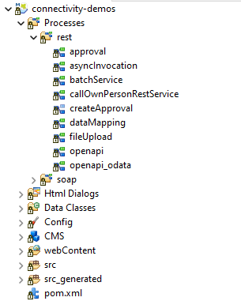

### Genehmigungs-Demo
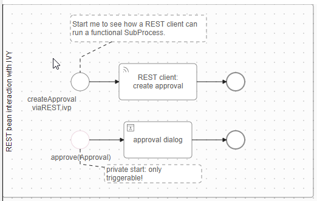

Der funktionale Unterprozess „createApproval” wird durch den REST-Aufruf
aufgerufen! [Approva-Demol](connectivity-approval2.png)
[Approva-Demol](connectivity-approval3.png)
[Approva-Demol](connectivity-approval4.png)

### Async-Demo
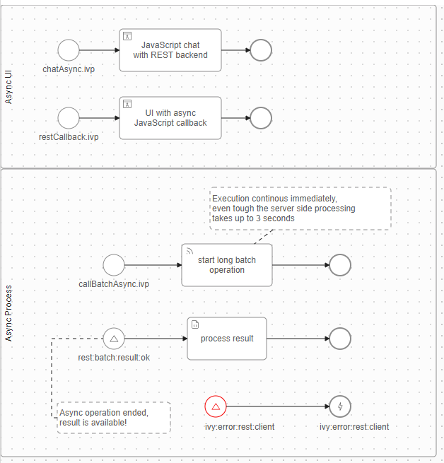

### batchService Demo
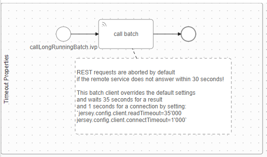

### callOwnPersonRestService Demo
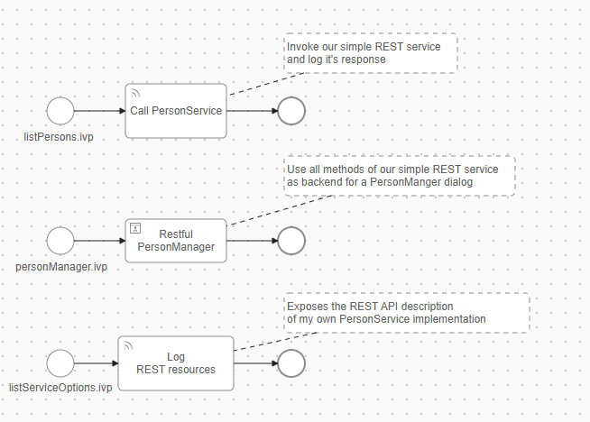

Benutzeroberfläche für den Prozess „personManager.ivp“ – hier wird gezeigt, wie
alle Methoden des selbst erstellten REST-Dienstes verwendet werden! [Restful
Person Manager](connectivity-person2.png)

In dieser Demo wurde ein REST-Client erstellt, der GET, PUT, POST und DELETE
bereitstellt! [Restful Person Manager](connectivity-person3.png)

### Datenzuordnung Demo
Hier werden verschiedene Optionen gezeigt, wie Sie das Daten-Mapping in einem
REST-Aufruf gestalten können. 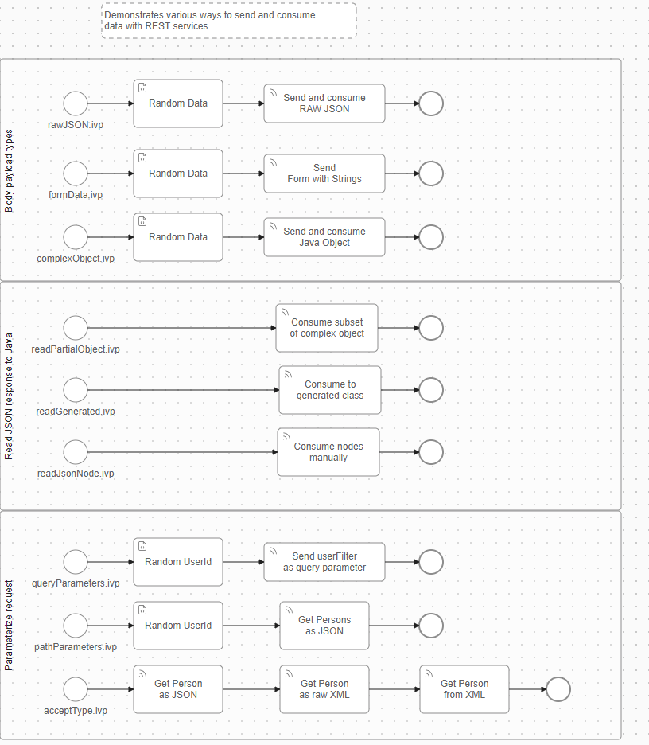

### Datei-Upload-Demo
Diese Demo verwendet einen Rest-Service-Aufruf, um eine Datei hochzuladen.\
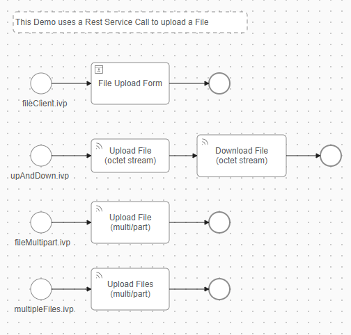

Es gibt auch eine Demo, die eine schöne Benutzeroberfläche für verschiedene
Lösungen zum Hochladen einer Datei zeigt.
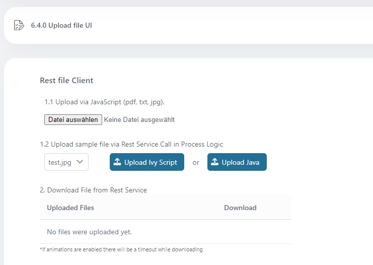

### OpenAPI-Demo

OpenAPI ist eine Spezifikation zum Erstellen von APIs, mit der Entwickler
RESTful-Webdienste in einem standardisierten, maschinenlesbaren Format
definieren, beschreiben und dokumentieren können. Dies vereinfacht die
Integration erheblich – dies gilt natürlich auch für die Integration in eine
Axon Ivy-Anwendung.

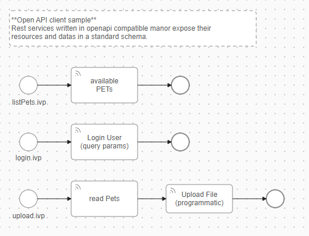

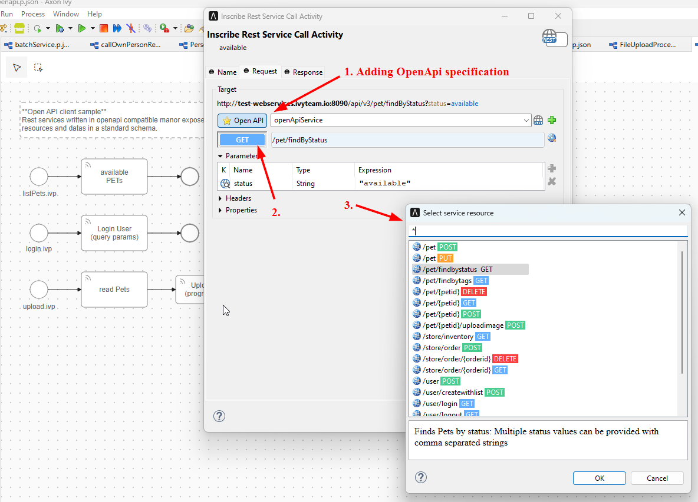

### OpenAPI OData Demo

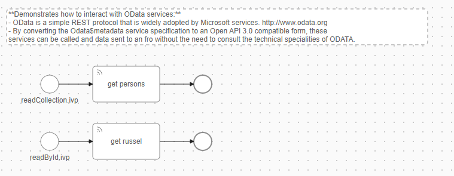

## Einrichtung

Installieren Sie einfach den Connector aus dem Designer heraus – mehr müssen Sie
nicht tun :blush:

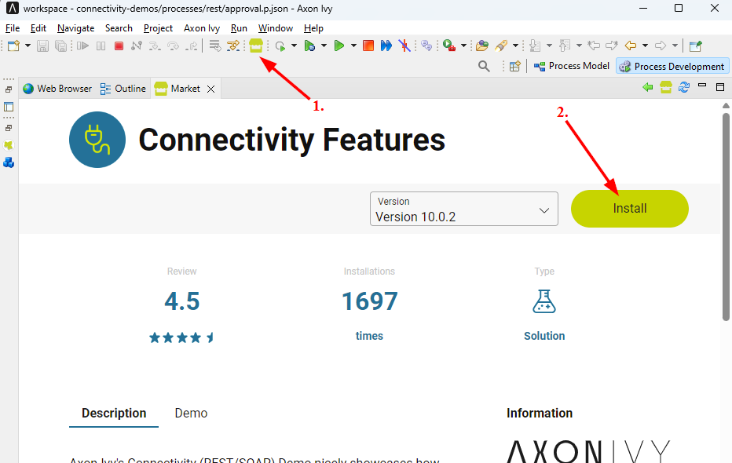
