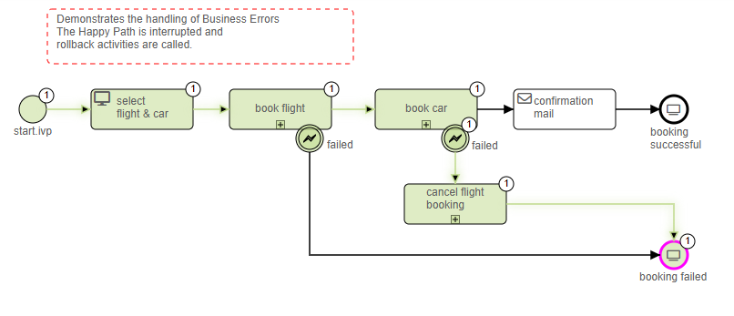

# Fehlerbehandlung Demo
Die Fehlerbehandlungsdemo von Axon Ivy zeigt anschaulich, wie einfach es sein
kann, auf Ausnahmen während der Prozessautomatisierung zu reagieren. Fehler
werden verwendet, um außergewöhnliche Prozesspfade zu modellieren. Mit einem
Fehler wird der Happy Path eines Prozesses verlassen. In Axon Ivy werden Fehler
in technische Fehler (z. B. Datenbankverbindungsproblem) und Geschäftsfehler (z.
B. Genehmigung abgelehnt) unterteilt. Die Lösung:

- Veranschaulicht einen Geschäftsfehler, der einen alternativen Ablauf auslöst.
- zeigt einen Geschäftsfehler, der den Happy Path unterbricht und
  Rollback-Aktivitäten auslöst.
- zeigt, wie ein Geschäftsprozess aufgrund eines Geschäftsfehlers beendet wird
- Enthält ein Beispiel dafür, wie man einen Ivy-Fehler lokal abfängt und als
  benutzerdefinierten Fehler weiterleitet.
- Veranschaulicht die Verwendung globaler Fehler
- bietet Zugriff auf gebrauchsfertige Vorlagen, z. B. zum Abbrechen eines
  Dialogs.

Weitere Informationen zur
[Fehlerbehandlung](https://developer.axonivy.com/doc/9/concepts/error-handling.html)
finden Sie in unserer Dokumentation.

## Demo

 
