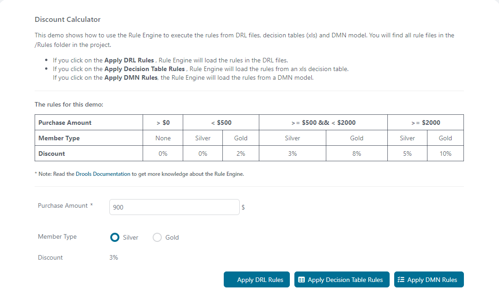

# Regel-Engine-Demo
Die Rule Engine Demo von Axon Ivy unterstreicht, wie wichtig es ist,
Geschäftslogik von Prozesslogik zu trennen. Eine Geschäftsregel ändert sich in
der Regel häufiger als das Prozessmodell und richtet sich auch an eine andere
Zielgruppe. Dank der integrierten Geschäftsregel-Engine ist dies mit Axon Ivy
ein Kinderspiel. Die Lösung:

- Zeigt die Verwendung verschiedener Regeldefinitionsstandards wie DMN-,
  DRL-Dateien und die Integration von Microsoft Excel-Entscheidungstabellen.
- Enthält ein kopierfertiges Beispiel mit anpassbaren Schwellenwerten für
  Geschäftsanwender.

Weitere Informationen zur
[Regel-Engine](https://developer.axonivy.com/doc/9/designer-guide/how-to/rule-engine.html)
finden Sie in unserer Dokumentation.

## Demo

 

## Einrichtung

Um die volle Design-Time-Unterstützung zu erhalten, wie z. B. die
Autovervollständigung für DRL-Bedingungen, konfigurieren Sie bitte alle Projekte
in Ihrem Arbeitsbereich für die Verwendung von Java 11.

Dazu gehen Sie wie folgt vor:
1. Klicken Sie mit der rechten Maustaste auf Ihr Projekt und wählen Sie im
   Kontextmenü „ `-Eigenschaften“ „` “ aus.
1. Wählen Sie links „ `“ (Java-Compiler-Konformitätsstufe) „` “
   (Java-Compiler-Konformitätsstufe) und stellen Sie „ `Compiler compliance
   level“ ( -Compiler-Konformitätsstufe) „`“ (Java-Compiler-Konformitätsstufe)
   auf „ `“ (Java-Compiler-Konformitätsstufe) „11“
   (Java-Compiler-Konformitätsstufe) ein.`
1. Wählen Sie links „ `“ „Project Facets“ „` “ und stellen Sie die Facette „ `“
   „Java“ „` “ auf die Version „ `“ „11“ „` “ ein.
1. Wenden Sie die Eigenschaften an und schließen Sie das Dialogfeld
   „Eigenschaften“.
