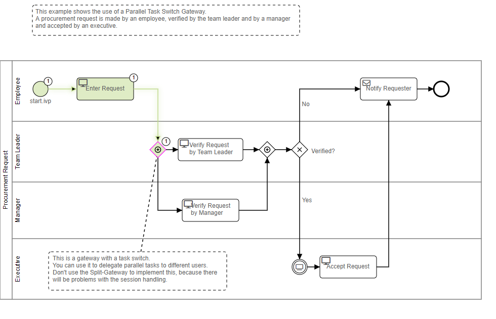
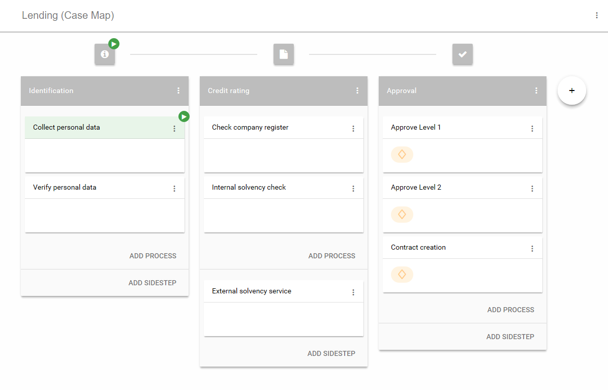

# Workflow Demo

The Workflow Demo by Axon Ivy showcases the implementation of various workflow use cases on the Axon Ivy platform using concrete examples.

The demo:  
- includes a fully functional casemap with ACM features and agile processes  
- demonstrates sequential and parallel task handling with manual interaction  
- illustrates the concepts and strengths of signals and triggers  
- shows the importance of business data and how to use it  
- contains many more examples in combination with workflow activities  

Learn more about [workflow](https://developer.axonivy.com/doc/9/designer-guide/how-to/workflow.html) and [adaptive case management](https://developer.axonivy.com/doc/9/concepts/adaptive-case-management.html) in our documentation.

## Demo

