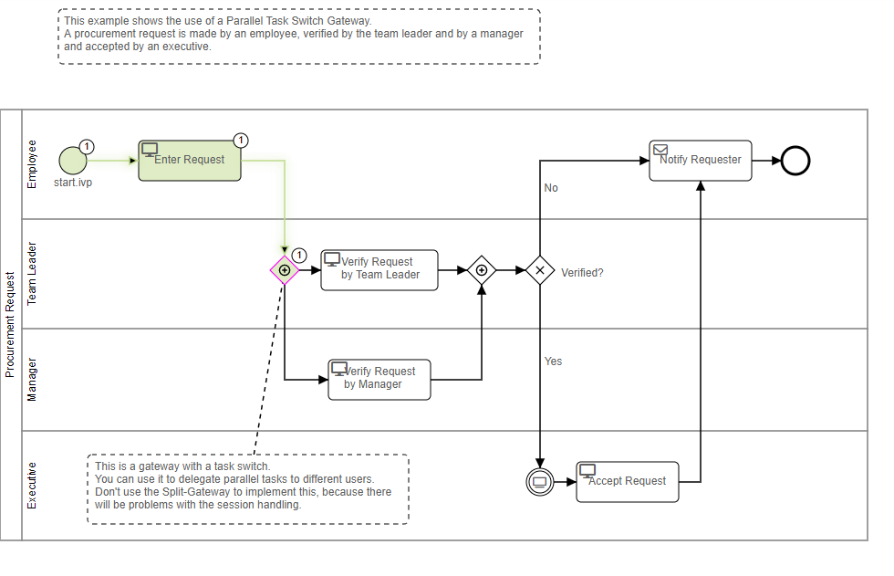

# Workflow-Demo

Die Workflow-Demo von Axon Ivy zeigt anhand konkreter Beispiele die Umsetzung
verschiedener Workflow-Anwendungsfälle auf der Axon Ivy-Plattform.

Die Demo:
- Enthält eine voll funktionsfähige Casemap mit ACM-Funktionen und agilen
  Prozessen.
- Demonstriert sequentielle und parallele Aufgabenbearbeitung mit manueller
  Interaktion.
- Veranschaulicht die Konzepte und Stärken von Signalen und Triggern.
- zeigt die Bedeutung von Geschäftsdaten und deren Verwendung auf.
- enthält viele weitere Beispiele in Kombination mit Workflow-Aktivitäten

Erfahren Sie mehr über
[Workflow](https://developer.axonivy.com/doc/9/designer-guide/how-to/workflow.html)
und [adaptives
Fallmanagement](https://developer.axonivy.com/doc/9/concepts/adaptive-case-management.html)
in unserer Dokumentation.

## Demo

 
